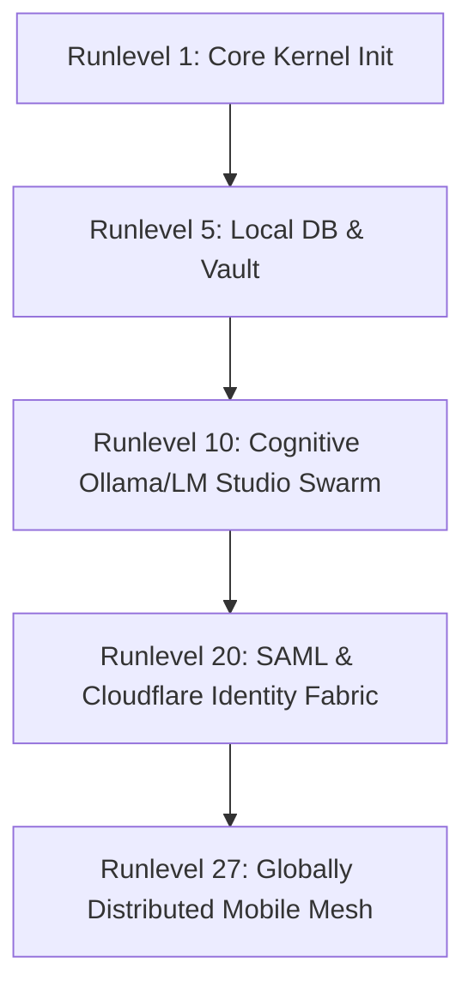

# 🛰️ Sovereign Mesh OS: Substrate 27 Architecture Spec

This document details the executable integration layer of the Sovereign OS, defining the Nate 5D Identity Solution, Substrate 27 Runlevel System, failover routing through TryCloudflare, and the Compose-ready Event State Bus.

## 🛠️ Runlevel 27: Android Native Global Mesh

Sovereign OS organizes its bootstrapping sequence into **27 distinct runlevels**. Runlevel 27 represents the fully materialized, globally distributed mesh executing native execution nodes on Android client handsets.



### Runlevel Matrix
- **Runlevel 1 (Core)**: Minimal kernel initialization, memory mapping, and crypto coprocessor attachment.
- **Runlevel 5 (Local)**: CockroachDB storage engine hydration, dynamic local vault connection.
- **Runlevel 10 (Cognitive)**: Local inference engine node arrays (Ollama, LM Studio API, token sentinel bounds).
- **Runlevel 20 (Identity)**: SAML Identity Provider live, Cloudflare Access token check bypass active.
- **Runlevel 27 (Global)**: High-trust P2P consensus, trycloudflare failover tunnels active, handset UI event state bus listening.

---

## 🔑 Nate 5D Identity Solution

The system models user identity as a **5-Dimensional mathematical coordinate space (Nate 5D)**, ensuring zero-trust verification across ephemeral mobile nodes.

1. **D1: Cryptographic DID**: Self-Sovereign decentralized identity document stored on CockroachDB.
2. **D2: Biometric/Hardware Anchor**: Handset secure enclave hardware-backed RSA signature.
3. **D3: Temporal Constraint**: Ephemeral session tokens bounded by time-ticks.
4. **D4: Spatial Grid**: Geo-coordinates signed by adjacent mesh peer nodes.
5. **D5: Cognitive Attestation**: Belief verification scores calculated dynamically by the Swarm.

---

## 🧱 trycloudflare Failover Route

To protect the system from primary tunnel failures or Cloudflare Access lockouts, the Go daemon runs `TunnelAgent` which spins up dynamic quick tunnels as backdoors.

### Failover Topology
```
[Handset UI Client] 
     │
     ├──► (Primary) ──► https://pqr.info/saml/metadata (Protected by Cloudflare Access)
     │
     └──► (Failover) ──► https://*.trycloudflare.com/saml/metadata (Dynamic quick tunnel bypass)
```

---

## 📱 Kotlin / Compose Event State Bus

Below is the Kotlin implementation of the **SovereignEventStateBus** that connects to the `StreamEnvelopes` protobuf flow and exposes state reactively to Jetpack Compose.

```kotlin
package info.pqr.sovereign.mesh.v1

import kotlinx.coroutines.flow.Flow
import kotlinx.coroutines.flow.MutableStateFlow
import kotlinx.coroutines.flow.StateFlow
import kotlinx.coroutines.flow.update
import java.time.Instant

data class SAMLStatusUi(
    val enabled: Boolean,
    val metadataUrl: String,
    val ssoUrl: String,
    val certSha256: String,
    val certExpiration: Instant?,
    val isDrifted: Boolean,
    val driftReason: String
) {
    companion object {
        fun initial() = SAMLStatusUi(
            enabled = false,
            metadataUrl = "",
            ssoUrl = "",
            certSha256 = "",
            certExpiration = null,
            isDrifted = false,
            driftReason = ""
        )
    }
}

data class NetworkTopologyUi(
    val nodeId: String,
    val runlevelState: String,
    val trycloudflareFailoverUrl: String,
    val activePeers: List<String>
) {
    companion object {
        fun empty() = NetworkTopologyUi(
            nodeId = "",
            runlevelState = "",
            trycloudflareFailoverUrl = "",
            activePeers = emptyList()
        )
    }
}

data class CognitionEventUi(
    val eventId: String,
    val eventType: String,
    val timestamp: Instant,
    val payloadSnippet: String
)

data class SovereignUiState(
    val samlStatus: SAMLStatusUi,
    val networkTopology: NetworkTopologyUi,
    val eventStream: List<CognitionEventUi>
)

interface EnvelopeStreamClient {
    fun streamEnvelopes(): Flow<Envelope>
}

class SovereignEventStateBus(
    private val client: EnvelopeStreamClient
) {
    private val _uiState = MutableStateFlow(
        SovereignUiState(
            samlStatus = SAMLStatusUi.initial(),
            networkTopology = NetworkTopologyUi.empty(),
            eventStream = emptyList()
        )
    )
    val uiState: StateFlow<SovereignUiState> = _uiState

    suspend fun start() {
        client.streamEnvelopes().collect { envelope ->
            applyEnvelope(envelope)
        }
    }

    private fun applyEnvelope(env: Envelope) {
        _uiState.update { current ->
            current.copy(
                samlStatus = deriveSamlStatus(env, current.samlStatus),
                networkTopology = deriveTopology(env, current.networkTopology),
                eventStream = deriveCognitionEvents(env, current.eventStream)
            )
        }
    }

    private fun deriveSamlStatus(env: Envelope, current: SAMLStatusUi): SAMLStatusUi {
        if (env.eventType != "IDENTITY_SAML_UPDATE") return current
        // Decode logic parsing from env.payload
        return current.copy(
            enabled = true,
            isDrifted = false
        )
    }

    private fun deriveTopology(env: Envelope, current: NetworkTopologyUi): NetworkTopologyUi {
        if (env.eventType != "NETWORK_TOPOLOGY_CHANGE") return current
        return current.copy(
            nodeId = env.identity.sovereignId,
            runlevelState = env.runlevel.name
        )
    }

    private fun deriveCognitionEvents(env: Envelope, current: List<CognitionEventUi>): List<CognitionEventUi> {
        val newEvent = CognitionEventUi(
            eventId = env.envelopeId,
            eventType = env.eventType,
            timestamp = Instant.ofEpochSecond(env.timestamp.seconds),
            payloadSnippet = env.payload.toStringUtf8()
        )
        return (listOf(newEvent) + current).take(50) // Cache latest 50
    }
}
```
